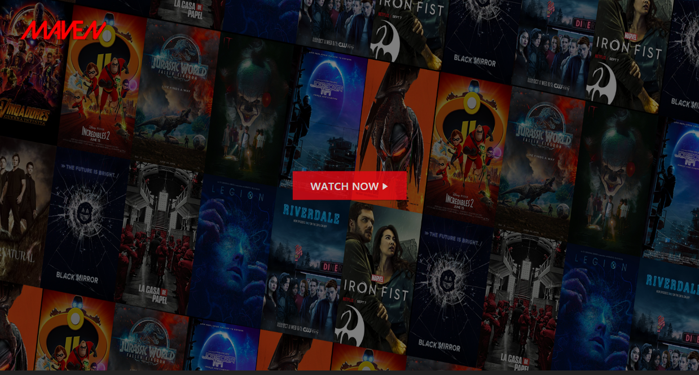

#   Maven
> A streaming system made with Angular, Node.js and PWA - Progress Web App.

<span style="position: relative; left: 35%; ">

 

</span>



### Installation
1. Front-End
```sh
$ git clone https://github.com/TacioAntonio/Maven
$ cd Maven/backend
$ npm i
$ npm start
```

2. Back-End
```sh
$ git clone https://github.com/TacioAntonio/Maven
$ cd Maven/frontend
$ npm i
$ npm start
```

3. [Http-server](https://www.npmjs.com/package/http-server)
```sh
$ http-server -p 4200 -c-1 dist/<project-name>
```

## Contribution
Please read [CONTRIBUTING.md](https://github.com/TacioAntonio/Maven/blob/master/CONTRIBUTING.md) for details on our code of conduct, and the process for submitting pull requests to us.

## Versioning
We use [SemVer](http://semver.org/) for versioning. For the versions available, see the [tags on this repository](https://github.com/TacioAntonio/Maven/tags).

## Authors
| 
| -
| [Tácio Antônio](https://github.com/TacioAntonio/)

See also the list of [contributors](https://github.com/TacioAntonio/Maven/graphs/contributors) who participated in this project.

## License
This project is licensed under the MIT License - see the [LICENSE.md](https://github.com/TacioAntonio/Maven/blob/master/LICENSE.md) file for details.
